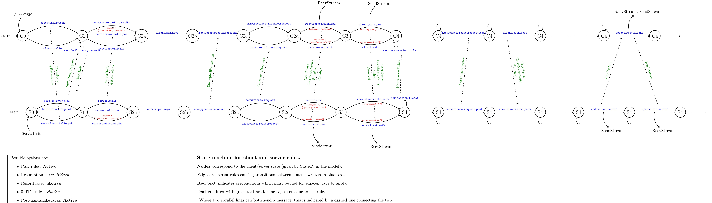

# [2. Protocol Overview](https://datatracker.ietf.org/doc/html/rfc8446#section-2)

/// html | div[style='float: left; width: 50%; padding: 5px;']
```title="RFC 8446"
TLS supports three basic key exchange modes:

-  (EC)DHE (Diffie-Hellman over either finite fields or elliptic
   curves)

-  PSK-only

-  PSK with (EC)DHE
```
///

/// html | div[style='float: right;width: 50%; padding: 5px;']
The Tamarin TLS model contains all three handshake types.
The libraries `src/client.splib` and `src/server.splib` contain all (EC)DHE related multiset rewriting rules.
The libraries `src/clientPsk.splib` and `src/serverPsk.splib` are related to the PSK-only and PSK with (EC)DHE mode.
///

/// html | div[style='clear: both;']
///

/// html | div[style='float: left; width: 50%; padding: 5px;']
```title="RFC 8446"
   Figure 1 below shows the basic full TLS handshake:

       Client                                           Server

Key  ^ ClientHello
Exch | + key_share*
     | + signature_algorithms*
     | + psk_key_exchange_modes*
     v + pre_shared_key*       -------->
                                                  ServerHello  ^ Key
                                                 + key_share*  | Exch
                                            + pre_shared_key*  v
                                        {EncryptedExtensions}  ^  Server
                                        {CertificateRequest*}  v  Params
                                               {Certificate*}  ^
                                         {CertificateVerify*}  | Auth
                                                   {Finished}  v
                               <--------  [Application Data*]
     ^ {Certificate*}
Auth | {CertificateVerify*}
     v {Finished}              -------->
       [Application Data]      <------->  [Application Data]
```
///

/// html | div[style='float: right;width: 50%; padding: 5px;']

///

/// html | div[style='clear: both;']
///

