```mermaid
stateDiagram-v2
    [*] --> C0

    C0 --> C1 : client_hello
    C1 --> C1 : recv_hello_retry_request
    C1 --> C2a : recv_server_hello

    C2a --> C2b : client_gen_keys
    C2b --> C2c : recv_encrypted_extensions

    C2c --> C2d : recv_certificate_request
    C2c --> C2d : skip_recv_certificate_request

    C2d --> C3 : recv_server_auth

    C3 --> C4 : client_auth<br>(cert_req_ctxt ≠ 0)
    C3 --> C4 : client_auth_cert<br>(cert_req_ctxt = 0)

    C4 --> C4 : recv_new_session_ticket
```

# [A.1. Client](https://datatracker.ietf.org/doc/html/rfc8446#appendix-A.1)

/// html | div[style='float: left; width: 50%; padding: 5px;']
```title="RFC 8446"
                          START <----+
           Send ClientHello |        | Recv HelloRetryRequest
      [K_send = early data] |        |
                            v        |
       /                 WAIT_SH ----+
       |                    | Recv ServerHello
       |                    | K_recv = handshake
   Can |                    V
  send |                 WAIT_EE
 early |                    | Recv EncryptedExtensions
  data |           +--------+--------+
       |     Using |                 | Using certificate
       |       PSK |                 v
       |           |            WAIT_CERT_CR
       |           |        Recv |       | Recv CertificateRequest
       |           | Certificate |       v
       |           |             |    WAIT_CERT
       |           |             |       | Recv Certificate
       |           |             v       v
       |           |              WAIT_CV
       |           |                 | Recv CertificateVerify
       |           +> WAIT_FINISHED <+
       |                  | Recv Finished
       \                  | [Send EndOfEarlyData]
                          | K_send = handshake
                          | [Send Certificate [+ CertificateVerify]]
Can send                  | Send Finished
app data   -->            | K_send = K_recv = application
after here                v
                      CONNECTED
```
///

/// html | div[style='float: left; width: 50%; padding: 5px;']

///


/// html | div[style='clear: both;']
///