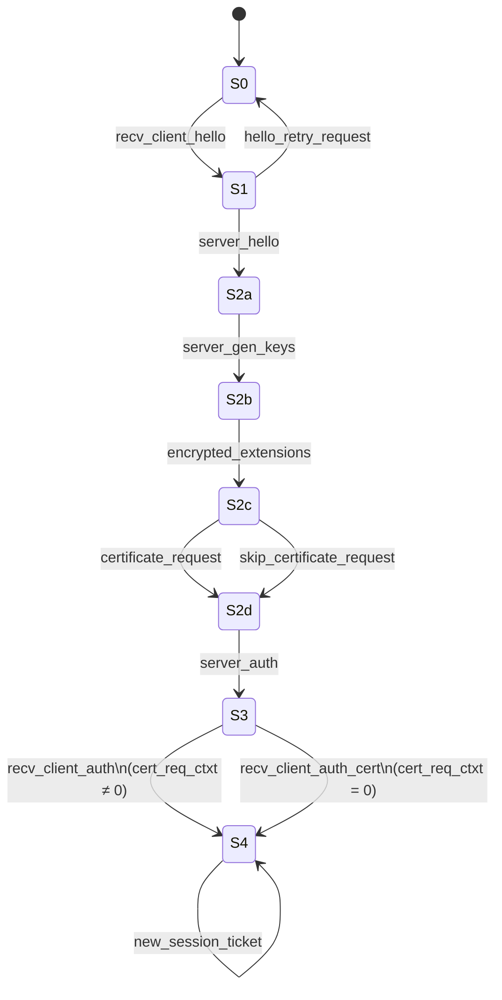

# [A.2. Server](https://datatracker.ietf.org/doc/html/rfc8446#appendix-A.2)

/// html | div[style='float: left; width: 50%; padding: 5px;']
```
                             START <-----+
              Recv ClientHello |         | Send HelloRetryRequest
                               v         |
                            RECVD_CH ----+
                               | Select parameters
                               v
                            NEGOTIATED
                               | Send ServerHello
                               | K_send = handshake
                               | Send EncryptedExtensions
                               | [Send CertificateRequest]
Can send                       | [Send Certificate + CertificateVerify]
app data                       | Send Finished
after   -->                    | K_send = application
here                  +--------+--------+
             No 0-RTT |                 | 0-RTT
                      |                 |
  K_recv = handshake  |                 | K_recv = early data
[Skip decrypt errors] |    +------> WAIT_EOED -+
                      |    |       Recv |      | Recv EndOfEarlyData
                      |    | early data |      | K_recv = handshake
                      |    +------------+      |
                      |                        |
                      +> WAIT_FLIGHT2 <--------+
                               |
                      +--------+--------+
              No auth |                 | Client auth
                      |                 |
                      |                 v
                      |             WAIT_CERT
                      |        Recv |       | Recv Certificate
                      |       empty |       v
                      | Certificate |    WAIT_CV
                      |             |       | Recv
                      |             v       | CertificateVerify
                      +-> WAIT_FINISHED <---+
                               | Recv Finished
                               | K_recv = application
                               v
                           CONNECTED
```
///

/// html | div[style='float: left; width: 50%; padding: 5px;']

///


/// html | div[style='clear: both;']
///