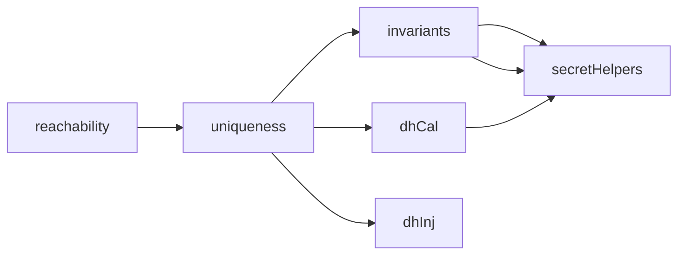

# Lemmas

All lemmas are located in the `src/lemmas` subfolder.
They are splitted into several groups which then are



```python
📦TLS13Tamarin
 ┗ 📂src
   ┗ 📂lemmas
     ┣ 📜atMostOf.splib # (1)
     ┣ 📜authHelpers.splib # (2)
     ┣ 📜dhCal.splib # (3)
     ┣ 📜dhInj.splib # (4)
     ┣ 📜invariants.splib # (5)
     ┣ 📜lemmas.splib # (6)
     ┣ 📜onePerTid.splib # (7)
     ┣ 📜reachability.splib # (8)
     ┣ 📜restrictions.splib # (9)
     ┣ 📜secretHelpers.splib # (10)
     ┗ 📜uniqueness.splib # (11)
```

1. abc
2. ab
3. ab
4. 
5. ab
6. ab
7. 
8. Sanity checks to proof that all states are reachable.
9. Global restrictions for the model and also source lemmas.
10. 
11. Checks that states are unique in a given session.

Lemmas are related to TLS security properties as follows:

| **Security Property** 	| **Lemma** 	|
|-----------	|----------	|
| 0         	|          	|
| 1         	|          	|
| 2         	|          	|
| 3         	|          	|
| 4         	|          	|
| 5         	|          	|