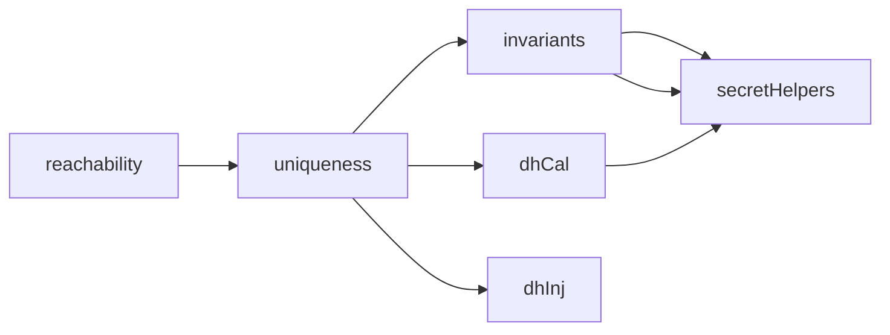

# Lemmas

All lemmas are located in the `src/lemmas` subfolder.


```mermaid
graph LR
    A[reachability] --> B[uniqueness]
    B --> C[invariants]
    B --> D[dhCal]
    B --> E[dhInj]
    C --> F[authHelpers]
    C --> F[secretHelpers]
    D --> F
```


```python
📦TLS13Tamarin
 ┗ 📂src
   ┗ 📂lemmas
     ┣ 📜atMostOf.splib # (1)
     ┣ 📜authHelpers.splib # (2)
     ┣ 📜dhCal.splib # (3)
     ┣ 📜dhInj.splib # (4)
     ┣ 📜invariants.splib # (5)
     ┣ 📜lemmas.splib # (6)
     ┣ 📜onePerTid.splib # (7)
     ┣ 📜reachability.splib # (8)
     ┣ 📜restrictions.splib # (9)
     ┣ 📜secretHelpers.splib # (10)
     ┗ 📜uniqueness.splib # (11)
```

1. abc
2. ab
3. ab
4. 
5. ab
6. ab
7. 
8. Sanity checks to proof that all states are reachable.
9. 
10. 
11. 